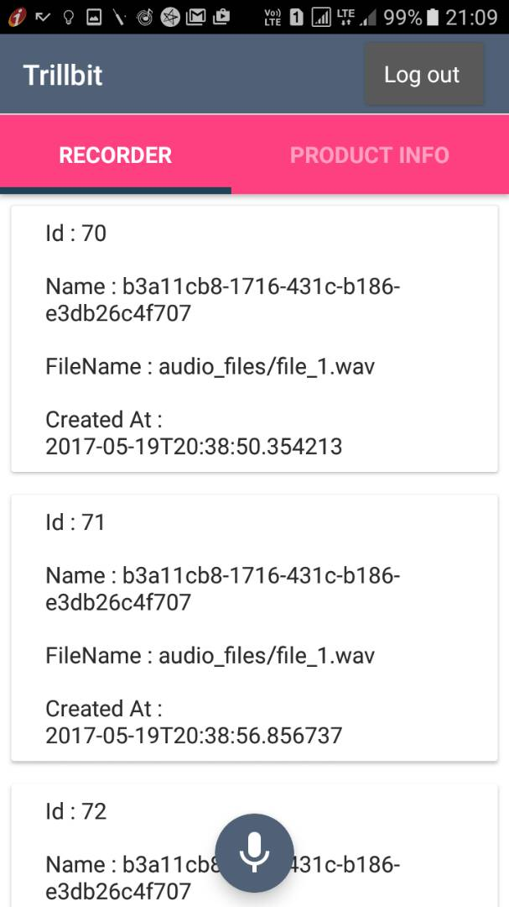

# Trillbit
Trillbit Android App

## Overview
# MVP - Model View Presenter
In this project I have followed MVP pattern for code maintainablity, easy to read and reusing the components. When using mvp, Activities and Fragments become part of the view layer and they delegate most of the work to presenters. Each Activity has a matching presenter that handles accessing the model via the TrillbitService. They also notify the Activities when the data is ready to display. Unit testing presenters becomes very easy by mocking the view layer (Activities).

## Final Output - Screenshots

Screen 1                          |Screen 2
:--------------------------------:|:--------------------------------:
  |

Screen 3                          |Screen 4
:--------------------------------:|:--------------------------------:
  |

## Download
You can download the apk here [TrillbitApp](../../raw/master/app/screenshots/app-stage-debug.apk)